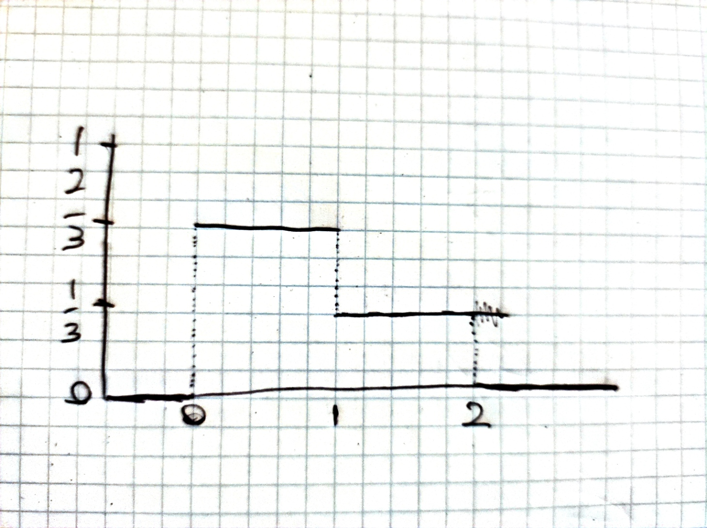

1. Let $X$ be a continuous random variable. And let $F(x)$ be the distribution function of $X$. Let $F(a)=1/5$ and $F(b)=3/5$.  
(a) What is $P(a\leq X\leq b)$?  
*Solution*:  
$$
\begin{aligned}
F(a<X\leq b)&=F(b)-F(a) \\
&=3/5-1/5 \\
&=2/5
\end{aligned}
$$
  
(b) What is $P(X>b)$?  
*Solution*:  
$$
\begin{aligned}
P(X>b)&=1-P(X\leq b) \\
&=1-F(b) \\
&=1-3/5 \\
&=2/5
\end{aligned}
$$
  
(c) What is $P(X<a\vee X>b)$?  
*Solution*:  
The $\vee$ means "or".  
$P(X<a\vee X>b)$ is everything outside the range $[a,b]$:
$$
\begin{aligned}
P(X<a\vee X>b)&=1-P(a\leq X\leq b) \\
&=1-2/5 \\
&=3/5
\end{aligned}
$$
  
(d) What is $P(X=a)$?
$$
\begin{aligned}
P(X=a)&=0
\end{aligned}
$$
The probability approaches zero, as the integral of $a$ to $a$ is $0$.  
  
2. Consider the continuous random variable $X$ with the following probability density function
$$
f(x)=
\begin{cases}
2/3 & \text{if } 0\leq x<1 \\
1/3 & \text{if } 1\leq x<2 \\
0 & \text{otherwise}
\end{cases}
$$
(a) Draw, with pen and paper, the probability density function of $X$, i.e. $f(x)$.  
*Solution*:  

  
(b) Determine the expression for the distribution function $F(x)$ of $X$, and draw it.  
*Solution*:  
$$
F(x)=
\begin{cases}
2/3x & \text{if } 0\leq x<1 \\
1/3 + 1/3x & \text{if } 1\leq x<2 \\
1 & \text{if } 2\leq x \\
0 & \text{otherwise}
\end{cases}
$$
It's the same, but instead of jumping at specific places it increases at a slope of $2/3$ between 0 and 1, and a slope of $1/3$ between 1 and 2. (I am not drawing it).  
  
3. The following exercises are about cumulative distribution functions and probability distribution functions.  
a) Let $X$ be a random variable with a $Exp(0.2)$ exponential distribution. Compute $P(X>2)$.  
*Solution*:  
$$
\begin{aligned}
P(X>2)&=1-P(X\leq 2) \\
&=1-F(2) \\
&=1-(1-\text{e}^{-2\cdot0.2}) \\
&\approx1-(1-0.6703) \\
&=0.6703 \\
&\approx67\%
\end{aligned}
$$
  
b) Let $X$ be a random variable with a $N(0,1)$ normal distribution. Compute $P(-0.2<X<0.4)$. You can use the table at the end of the book. In this case, note that the distribution $N(0,1)$ is symmetric around $0$; use this fact to your advantage when you use the table.  
*Solution*:  
$Y:R-[0;1], P(-0,2<x<0.4)=?$  
$$
\begin{aligned}
P(X<0.4)=1-P(X>0.4)=1-0.3446&=0.6554 \\
P(X<-0.2)=P(X>0.2)&=0.4207 \\
P(-0.2<X<0.4)=P(X<-0.2)=0.6554-0.4207&=0.2347
\end{aligned}
$$
The two important values are $P(Z\geq 0.2)$ and $P(Z\geq 0.4)$. The former is $0.4207$ and the latter $0.3446$. The probability of $P(X<0.4)$ is $1-P(X\geq 0.4)=1-0.3446=0.6554$. Then,
$$
\begin{aligned}
  P(-0.2<X)&=P(0.2<X)\cdot2 \\
  &=(1-P(X\geq0.2))\cdot2 \\
  &=(1-0.4207)\cdot2 \\
  &=0.5793\cdot2 \\
  &=1.1586
\end{aligned}
$$
and finally
$$
\begin{aligned}
P(X<0.4)-P(-0.2<X)&=0.6554-1.1586 \\
&=-0.5032
\end{aligned}
$$
  
c) Consider the standard normal distribution, i.e. $N(0,1)$. What is the $15$th percentile of this distribution? (Note that this is equivalent to the 0.15 quantile.)  
*Solution*:  
Looking in the table, the value closest to 0.15 is $0.1492$. This is the right-tail distribution, but we need the left tail, which is $1-0.1492=0.8508$. This is equal to $F(1.04)$.
   
4. In R you can easily use several standard distributions. For instance, by using the commands ‘dnorm’, ‘pnorm’, ‘qnorm’, ‘rnorm’, you get access to the density, distribution, quantile, and random number generation of the normal distribution, respectively.  
(a) Generate 10 normally distributed samples from the standard normal distribution N(0,1). Plot them in R together with graphs of the corresponding probability density function and the distribution function.  
*Solution*:  
