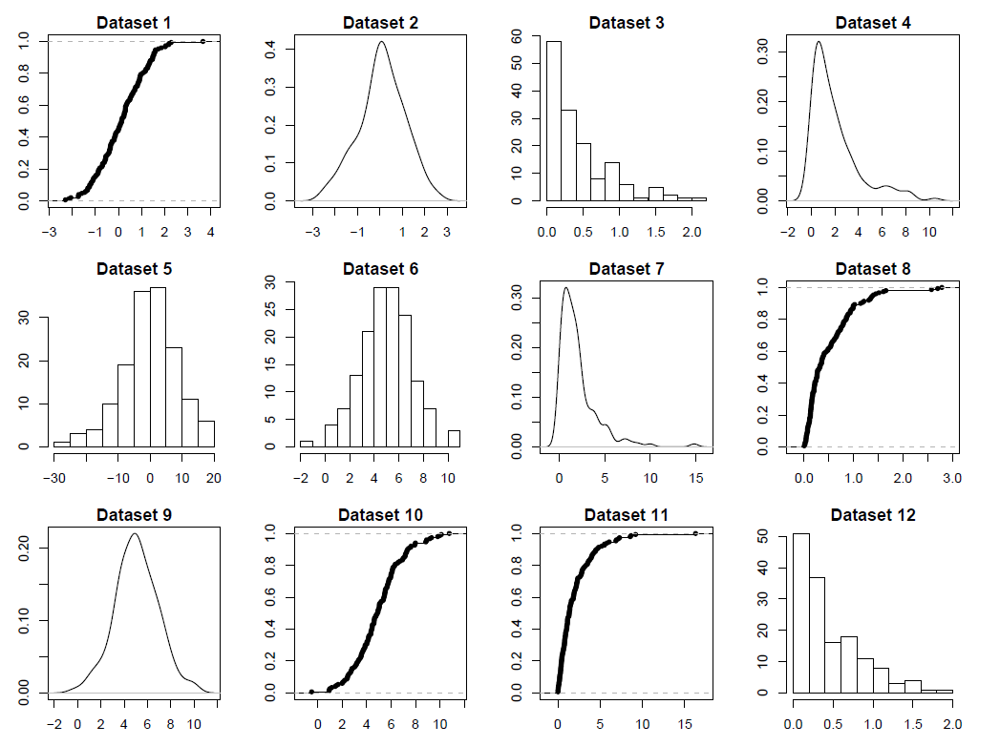

# 1. Central Limit Theorem (T)  
Let $X1,X2,\dots$ be a sequence of independent, identically distributed random variables, with probability density function given by
$$
f(x)=\begin{cases}
x,&\text{if }0<x\leq1 \\
-x+2,&\text{if }1<x<2 \\
0,&\text{otherwise}.
\end{cases}
$$
Use central limit theorem to approximate $P(X_1+X_2+\dots+X_{277}>301)$.  
  
*Solution*:  
We first need to transform the variable:
$$
\begin{aligned}
P(X_1+X_2+\dots+X_{277}>301)&=P(X_1+X_2+\dots+X_{277}-277\mu>301-277\mu) \\
&=P\left(\frac{X_1+X_2+\dots+X_{277}-277\mu}{\sigma\sqrt{277}}>\frac{301-277\mu}{\sigma\sqrt{277}}\right) \\
&=P(Z_{277}>\frac{301-277\mu}{\sigma\sqrt{277}})
\end{aligned}
$$
First we need the expected value $\mu$ and the variance $\sigma^2$.  
$$
\begin{aligned}
\mu=\mathrm{E}[X_i]&=\int_0^2 xf(x)\ \mathrm{d}x \\
&=\int_0^1 x\cdot x\ \mathrm{d}x + \int_1^2 x\cdot(-x+2)\ \mathrm{d}x \\
&=\left[\frac{1}{3}x^3\right]_0^1 + \left[-\frac{1}{3}x^3+x^2\right]_1^2 \\
&=3-\frac{6}{3} \\
&=\frac{9}{3}-\frac{6}{3} \\
&=1
\end{aligned}
$$
To calculate the variance, we also need to calculate $\mathrm{E}[X^2]$.
$$
\begin{aligned}
\mathrm{E}[X_i^2]&=\int_0^2 x^2f(x)\ \mathrm{d}x \\
&=\int_0^1 x^2\cdot x\ \mathrm{d}x + \int_1^2 x^2\cdot(-x+2)\ \mathrm{d}x \\
&=\left[\frac{1}{4}x^4\right]_0^1 + \left[-\frac{1}{4}x^4+\frac{2}{3}x^3\right]_1^2 \\
&=\frac{1}{4}-\frac{16}{4}+\frac{16}{3}+\frac{1}{4}-\frac{2}{3} \\
&=\frac{3}{12}-\frac{48}{12}+\frac{64}{12}+\frac{3}{12}-\frac{8}{12} \\
&=\frac{14}{12} \\
&=\frac{7}{6}
\end{aligned}
$$
Now we can calculate the variance
$$
\begin{aligned}
\sigma^2=Var(X_i)&=\mathrm{E}[X_i^2]-(\mathrm{E}[X_i])^2 \\
&=\frac{7}{6}-1 \\
&=\frac{7}{6}-\frac{6}{6} \\
&=\frac{1}{6}
\end{aligned}
$$
And of course, $\sigma=\sqrt{\sigma^2}=\sqrt{\frac{1}{6}}=\frac{1}{\sqrt{6}}$.
Now we plug the numbers into the formula from earlier:
$$
\begin{aligned}
P\left(Z_{277}>\frac{301-277\mu}{\sigma\sqrt{277}}\right)&=P\left(Z_{277}>\frac{301-277}{\frac{1}{\sqrt{6}}\sqrt{277}}\right) \\
&=P\left(Z_{277}>\frac{24}{\sqrt{\frac{277}{6}}}\right) \\
&\approx P(Z_{277}>3.53221) \\
&=1-P(Z_{277}<3.53221) \\
&\approx1-\Phi(3.53221) \\
&=0.0002
\end{aligned}
$$

# Simple Statistics (R)  
Consider the `firstchi` dataset, available in the `UsingR` package, which you can load using the `library(UsingR)` statement. Using `R` functions, compute the following numerical statistics for the dataset.  
* the sample mean  
* the sample variance  
* the 30th empirical percentile  
* the median  
* the MAD  
You can refer to Section 2.3 of *Using R for introductory statistics*.  
  
*Solution*:  
```{r}
library(UsingR)
firstchi
```
```{r}
mn <- mean(firstchi)
sv <- var(firstchi)
prcnt <- quantile(firstchi, .30)
mdn <- median(firstchi)
md <- mad(firstchi)

cat(sprintf("Mean: %s\nSample variance: %s\n30th percentile:%s\nMedian: %s\nMAD: %s", mn, sv, prcnt, mdn, md))
```
# 5. [sic] Recognizing plots (Theory)  
Consider the following distributions:  
* $N(0, 1)$  
* $N(0, 8)$  
* $N(5, 2)$  
* $Exp(2)$  
* $Exp(1/2)$  
The following plots report histograms, kernel density estimates, and empirical distribution functions, each for a different dataset of 150 points generated from the above distributions. For each plot, say which type of plot it is (i.e. if it’s a histogram, a kernel density estimate or an empirical distribution function), and identify from which of the above distributions it was generated.  
  
  
*Solution*:  
1. Empirical distribution function, $N(0,1)$.  
2. Kernel density estimation, $N(0,1)$.  
3. Histogram, $Exp(2)$.  
4. Kernel density estimation, $Exp(1/2)$.  
5. Histogram, $N(0,8)$.  
6. Histogram, $N(5,2)$.  
7. Kernel density estimation, $Exp(1/2)$.  
8. Empirical distribution function, $Exp(2)$.  
9. Kernel density estimation $N(5,2)$.  
10. Empirical distribution function, $N(5,2)$. 
11. Empirical distribution function, $Exp(1/2)$.  
12. Histogram, $Exp(2)$.  
  
#4. Plotting distributions (R)  
The `diamond` dataset of the `UsingR` package contains the price in Singapore dollars of 48 diamond rings, along with their size in carats.  
1. Plot the kernel density estimate of prices. Try different bandwidths. How many modes are there? Look also at the empirical cumulative distribution function. Discuss your findings.  
2. Plot a scatterplot of prices versus sizes. Does any relation between the two quantities show up?  
  
*Solution*:  
```{r}
kernel <- density(diamond$carat, bw="SJ")
plot(kernel)
est <- ecdf(diamond$carat)
plot(est)
```
```{r}
plot(diamond$price, diamond$size)
```
  
# 5. Mean and median of two datasets (Theory)  
Consider two datasets $x_1,\dots,x_n$ and $y_1,\dots,y_m$. Note that they have different lengths. Let $\bar{x}$ be the sample mean of the first, and $\bar{y}$ the sample mean of the second. Consider the combined dataset $x_1,\dots, x_n, y_1,\dots, y_m$ with $m + n$ elements, obtained by concatenating the two original datasets.  
a. Is it true that the sample mean of the combined dataset is equal to $\frac{\bar{x}+\bar{y}}{2}$? If yes, provide a proof, if no, provide a counterexample.  
b. Consider the case where $m = n$, i.e. the two datasets have the same size. In this special case, is the sample mean of the combined dataset equal to $\frac{\bar{x}+\bar{y}}{2}$? If yes, provide a proof, if no, provide a counterexample.  
c. Consider now the sample medians $Med_x$ and $Med_x$ of the two datasets, in the general case of $m\neq n$. Is it true that the sample median of the combined dataset is equal to $\frac{Med_x+Med_y}{2}$? If yes, provide a proof, if no, provide a counterexample.  
d. In the special case of $m=n$, is the sample median of the combined dataset is equal to $\frac{Med_x+Med_y}{2}$? If yes, provide a proof, if no, provide a counterexample.  
  
*Solution*:  
Let's call the new dataset $z$.
a. No.  
$$
\begin{aligned}
\bar{x}&=\frac{x_1+\dots+x_n}{n} \\
\bar{y}&=\frac{y_1+\dots+y_m}{m} \\
\bar{z}&=\frac{x_1+\dots+x_n+y_1+\dots+y_m}{n+m}
\end{aligned}
$$
This would only be true if $n+m=2$, that is, either $x$ or $y$ is empty, or each only has 1 element, thus making both their means that same element.  
Counterexample:
$$
\begin{aligned}
\bar{x}&=\frac{1+2+3}{3}=2 \\
\bar{y}&=\frac{4+5+6+7}{4}=5.5 \\
\bar{z}&=\frac{1+2+3+4+5+6+7}{7}=4 \\
\frac{\bar{x}+\bar{y}}{2}&=\frac{2+5.5}{2}=3.75
\end{aligned}
$$  
b. Yes.  
$$
\begin{aligned}
\bar{x}&=\frac{x_1+\dots+x_n}{n} \\
\bar{y}&=\frac{y_1+\dots+y_n}{n} \\
\bar{z}&=\frac{x_1+\dots+x_n+y_1+\dots+y_n}{n+n} \\
&=\frac{x_1+\dots+x_n+y_1+\dots+y_n}{2n} \\
&=\frac{\frac{x_1+\dots+x_n+y_1+\dots+y_n}{n}}{2} \\
&=\frac{\frac{x_1+\dots+x_n}{n}+\frac{y_1+\dots+y_n}{n}}{2} \\
&=\frac{\bar{x}+\bar{y}}{2}
\end{aligned}
$$  
  
c. No.  
Counterexample:  
$$
\begin{aligned}
Med_x\text{ of } \{1, 2, 3, 4\}&=2.5 \\
Med_y\text{ of } \{7, 8, 9, 10, 11\}&=9 \\
Med_z\text{ of } \{1, 2, 3, 4, 7, 8, 9, 10, 11\}&=7 \\
\frac{Med_x+Med_y}{2}&=\frac{2.5+9}{2}=5.75.
\end{aligned}
$$
d. Yes. Not sure how to prove it though. Call it a conjecture.  