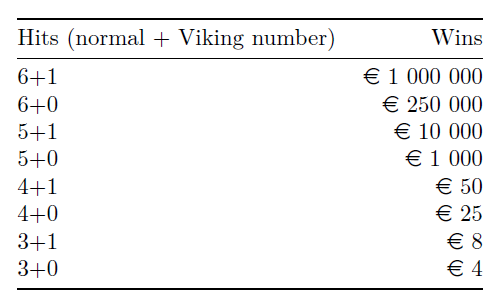

# 1 Probability Theory  
Consider an experiment where you twice roll a fair die with four sides. The values on the sides of the die are 1, 2, 3 and 4.  
a) Choose a natural sample space $\Omega$ for this experiment.  
  
*Solution*:  
The sample space is simply the possible outcomes, $\Omega=\{1,2,3,4\}$.  
  
b) Write down the set of outcomes corresponding the each of the following events  
- A : “the sum of the two die rolls is greater than or equal to 6”  
- B : “the value of the first roll is strictly smaller than the value of the second roll”  
- C : “the values of the fist and second roll are the same”  
  
*Solution*:  
- A: $\{2,4;3,3;3,4;4,2;4,3;4,4\}$  
- B: $\{1,2;1,3;1,4;2,3;2,4;3,4\}$  
- C: $\{1,1;2,2;3,3;4,4\}$  
  
c) Calculate the probability of the three events above, that is $P(A)$, $P(B)$ and $P(C)$.  
  
*Solution*:  
The total number of events is $16$. I can therefore calculate the probably of an event by $|\Omega|/16$.  
- A: $|A|/16=6/16=0.375$  
- B: $|B|/16=6/16=0.375$  
- C: $|C|/16=4/16=0.25$  
  
d) Explain in words what the probability $P(A|C)$ means and calculate the probability $P(A|C)$.  
  
*Solution*:  
$P(A|C)$ means "the probability of $A$ given $C$". It represents the probability of $A$ happening, given the knowledge that $C$ has already happened.  
It is calculated by
$$
\mathrm{P}(A|C)=\frac{\mathrm{P}(A\cap C)}{\mathrm{P}(C)}=\frac{\mathrm{P}(\{2,4;3,3;3,4;4,2;4,3;4,4\}\cap\{1,1;2,2;3,3;4,4\})}{0.25}=\frac{\mathrm{P}(\{3,3;4,4\})}{0.25}=\frac{\frac{2}{16}}{0.25}=\frac{0.125}{0.25}=0.5=50\%
$$  
  
Now consider an experiment where you roll the die 10 times. Let $X$ be the random variable representing
the number of times you roll a 2.  
e) What is the distribution of $X$? What is the probability of rolling a 2 exactly 5 times in 10
rolls, i.e. $P(X = 5)$?  
  
*Solution*:  
The probability for any dice roll to be a 2 is $1/4$. If we say the random variable $Y$ is equal to 1 if we get a 2, and equal to 0 otherwise, $Y$ is a Bernoulli distributed random variable with $p=1/4$. In this case, $X$ is a sum of 10 $Y$. A sum of Bernoulli random variables is a binomial random variable, so $X$ has binomial distribution.  
To calculate $P(X=5)$, we need the definition of the binomial variable:
$$
P(X=k)=\binom{n}{k}p^k(1-p)^{n-k} \text{ for } k=0,1,\dots,n.
$$
In this case $p=1/4$, $k=5$ and $n=10$.  
$$
\binom{10}{5}(1/4)^5(3/4)^5=\frac{252}{1024}\cdot\frac{243}{1024}=\frac{61236}{1048576}=\frac{15309}{262144}\approx0.0584\approx5.84\%
$$
  
# Hypothesis Testing  
According to the Danish ministry of education, when the Danish 7-point grading scale (consisting of
the grades -3, 00, 02, 4, 7, 10 and 12) is used nationally and over a long period of time, the mean pass
grade should be 7. In the year 2028 you are looking at the grades for the 681 student who have passed
the course in Applied Statistics at ITU in the past 10 years. The sample mean and sample standard
deviation of the grades are $\bar{x}_{681}=7.15$ and $s_{681}=3.07$. You observe that that the sample mean is higher
than 7, so you decide to investigate if the mean grade for the Applied Statistics course may be different
from 7 using hypothesis testing. With 681 observations you can assume that this is a large sample size.  
a) Formulate an appropriate null hypothesis and alternative hypothesis.  
  
*Solution*:  
The null hypothesis is what we already expect is happening, e.g. $H_0: \mu=7$ where $\mu$ is the "true" mean of the distribution. The alternate hyopothesis is $H_1: \mu>7$.  
  
b) Which test is appropriate for testing the hypothesis? Explain why.  
  
*Solution*:  
Since we want to test for the mean, a t-test is appropriate. Since we are told to assume that the sample is large, we can make use of the Z-test.  
  
c) Compute the value of the test statistic and report your conclusion at significance level $\alpha=0.05$.  
  
*Solution*:  
The test statistic for the Z-test is
$$
T=\frac{\bar{X}_n-\mu_0}{S_n/\sqrt{n}}.
$$
The value of this test statistic, $t$ is
$$
t=\frac{\bar{x}_n-\mu_0}{s_n/\sqrt{n}}=\frac{7.15-7}{3.07/\sqrt{681}}\approx\frac{0.15}{0.1176}\approx1.275
$$
As $T$ is the studentised mean under $H_0$, the distribution of $T$ approaches the standard normal distribution as the sample size increases, and we can therefore approximate by such.  
$$
P(T>t)\approx P(Z>t)
$$
where $Z\sim N(0,1)$.  
Therefore,
$$
P(T>z_\alpha)=\alpha
$$
where $z_\alpha$ is the critical value for $N(0,1)$ with tail probability $\alpha$.  
We can find this critical value with the quantile/`qnorm` function, setting $\alpha=0.05$:
```{r}
cv <- qnorm(1-0.05, 0, 1)
cat("Critical value at alpha=0.05:", cv)
```
Since $t<z_\alpha$, we do not reject the null hypothesis under significance level $\alpha=0.05$.  
  
d) Compute the corresponding one-tailed p-value. Is the evidence against the null hypothesis
strong?  
  
*Solution*:  
We can Calculate the p-value from the distribution function, `pnorm`:
```{r}
t <- 1.2750477217
p <- 1-pnorm(t, 0, 1)
cat("p-value:", p)
```
The p-value tells us that there's 10% chance that higher grade mean is just a fluke, which isn't strong enough evidence against the null hypothesis.  
  
# 3 Small R Questions  
**3a. Correlation  **
The `maydow` (`UsingR`) data set contains the Dow Jones industrial average and the maximum daily
temperature in New York City for May 2003. Make a scatter plot of the industrial average against the
maximum temperature. Are the Dow Jones index and the temperature correlated?  
  
*Solution*:  
```{r, echo=FALSE}
library(UsingR)
head(maydow)
```
Let's make a scatterplot  
```{r}
plot(maydow$max.temp, maydow$DJA)
```
There is no clear relation between max temp and DJA.  
  
**3b. Simple statistics**  
The `babies` (`UsingR`) data set is a collection of variables taken for each new mother in a study. The
variable `age` contains the mothers age in years if known, otherwise the value is 99. Compute the minimum,
maximum, mean, median, and standard deviation of those mothers’ age which are known. What can you
conclude of the age distribution on the basis of these numbers?  
  
*Solution*:  
I start by filtering the data by ages that are not 99.  
```{r, echo=FALSE}
filt_babies <- babies[babies$age != 99,]
```
Now I can calculate the requested values.
```{r, echo=FALSE}
min_ <- min(filt_babies$age)
max_ <- max(filt_babies$age)
mean_ <- mean(filt_babies$age)
median_ <- median(filt_babies$age)
sd_ <- sd(filt_babies$age)

cat("Minimum:", min_)
cat("\nMaximum:", max_)
cat("\nMean:", mean_)
cat("\nMedian:", median_)
cat("\nStandard deviation:", sd_)
```
The mean is only slightly larger than the median, so the data is not that skewed. Based on the standard distribution, and assuming the distribution is roughly normal, we can say that 70% of the mothers were within ~5.8 years of 27, which is what we can expect most of the mothers ages to be.  
  
**3c. Linear Regression**  
The data set `wellbeing` (`UsingR`) contains factors affecting people’s happiness in several countries.
Fit a linear model with the alcohol consumption as the explanatory variable, and estimate how many
percentage the well-being is increased, in the reported units, if the alcohol consumption is decreased from
16 to 8 units.  
  
*Solution*:  
I start by taking a quick look at the data
```{r}
head(wellbeing)
```
Then I fit the linear model.  
```{r, echo=FALSE}
model <- lm(wellbeing$Well.being ~ wellbeing$Alcohol.consumption)

summary(model)

plot(wellbeing$Alcohol.consumption, wellbeing$Well.being)
abline(model)
```
The summary we can see that for each unit increase in alcohol consumption, wellbeing decreases by ~0.098. So if we decreases alcohol consumption by 8 units, wellbeing will increase by $8\cdot0.09769=0.78152\approx0.78$ units.  
  
**3d. Confidence intervals**  
The variable weight in `kid.weights` (`UsingR`) data set contains the weights of a random sample of
children. Find a 90% confidence interval for the mean weight of 5-year-olds. You’ll need to isolate just
the 5-year-olds’ data first.
```{r}
yr5 <- subset(kid.weights, subset = 5*12 <= age & age < 6*12)
```
  
*Solution*:  
The calculation for the confidence interval changes depending on the distribution of the data.
```{r}
plot(density(yr5$weight))
```
That does *not* look normally distributed, at least nor normal enough. In that case we need to bootstrap the standerdised mean.
```{r}

sqrt_n <- sqrt(length(yr5$weight))
data_mean <- mean(yr5$age)

bt_t_s <- c()
for (i in 1:10000) {
  bootstrap_sample <- sample(yr5$weight, length(yr5$weight), replace=TRUE)
  bootstrap_mean <- mean(bootstrap_sample)
  bootstrap_sd <- sd(bootstrap_sample)
  
  t_s <- (bootstrap_mean - data_mean) / (bootstrap_sd / sqrt_n)
  bt_t_s <- c(bt_t_s, t_s)
}
```
Now we can determine $c_l^*$ and $c_u^*$ such that
$$
\mathrm{P}\left(c_l^*<\frac{\bar{X}_n^*-\mu^*}{S_n^*/\sqrt{n}}<c_u^*\right)\approx1-\alpha.
$$
Since the ECDF of the bootstrapped values is an unbiased estimator for the true studentised mean, we can take the inverse of it to find these values. The inverse of the ecdf function is the quantile function.  
```{r}
cl <- quantile(bt_t_s, 0.05)
cu <- quantile(bt_t_s, 0.95)
cat("Critical values:", cl, ",", cu)
```
We can then create the confidence interval:
$$
\left(\bar{x}_n-c_u^*\frac{s_n}{\sqrt{n}},\bar{x}_n-c_l^*\frac{s_n}{\sqrt{n}}\right).
$$
```{r}
data_sd <- sd (yr5$weight)
lo <- data_mean - cu * (data_sd / sqrt_n)
hi <- data_mean - cl * (data_sd / sqrt_n)
cat("Confidence interval: [", lo, ",", hi, "]")
```
We are 90% confident that the true weight is within this interval.  
  
# 4 Viking Lottery  
In Viking Lottery one may select 6 numbers from 1 to 48 and an extra “Viking” number from 1 to 8.
Make a program that simulates the lottery by drawing six numbers from 1 to 48 without replacement and
an independent Viking number from 1 to 8. Choose your luck row of numbers and simulate the lottery
by playing it 100 times. How much would you have got as a profit? Assume that playing one row costs
80 cents.


*Solution*:  
I start by defining the drawing functions. Since the lottery gives different rewards if you get your viking number, it needs a separate variable.  
```{r}
draw_normal <- function() {
  return(
    sample(1:48, 8)
  )
}
draw_viking <- function() {
  return(
    sample(1:8, 1)
  )
}
```
I choose my lucky numbers to be [1, 2, 3, 4, 5, 6, 7, 8] [4] because I'm original like that.  
Time to simulate the 100 lotteries. 
```{r}
winnings <- function(regular, viking) {
  r_drawn <- draw_normal()
  v_drawn <- draw_viking()
  
  reg_corr <- 0
  for (i in r_drawn) {
    # literally how the fuck do you get the number of common elements of two vectors i need stack exchange for this
    reg_corr <- reg_corr + sum(regular == i)
  }
  
  vik_corr <- sum(viking == v_drawn)
  
  # shitty ass if chain
  if (reg_corr < 3) {
    return(0)
  }
  if (reg_corr == 3) {
    if (vik_corr == 0) {
      return(4)
    } else {
      return(8)
    }
  } else if (reg_corr == 4) {
    if (vik_corr == 0) {
      return(25)
    } else {
      return(50)
    }
  } else if (reg_corr == 5) {
    if (vik_corr == 0) {
      return(1000)
    } else {
      return(10000)
    }
  } else if (reg_corr == 6) {
    if (vik_corr == 0) {
      return(250000)
    } else {
      return(1000000)
    }
  }
}

dolla <- 0
reg_winners <- c(1,2,3,4,5,6,7,8)
vik_winners <- c(4)
for (i in 1:100) {
  dolla <- dolla - 0.8
  dolla <- dolla + winnings(reg_winners, vik_winners)
}
cat("Reaped in", dolla, "euro from da biz")
```
easy money fr.